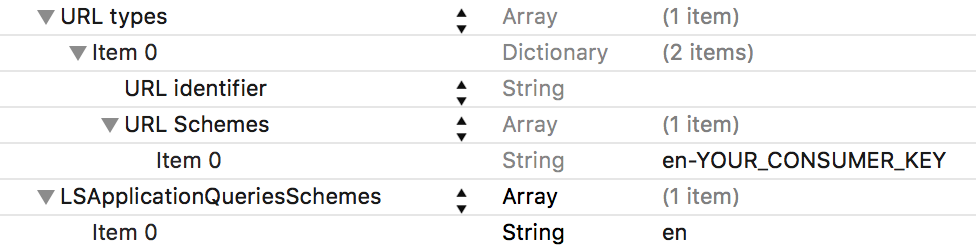

# Evernote Cloud SDK 3.0 for iOS

This is the official Evernote SDK for iOS. To get started, follow the instructions bellow. Additional information can be found in the [Getting Started Guide](Getting_Started.md).

More information about our developer program can be found here: [Evernote Developers](https://dev.evernote.com/)

## Installation
### Cocoapods
```ruby
pod 'evernote-cloud-sdk-ios', '~> 3.0'
```

### Manually

Drag & Drop `evernote-sdk-ios.xcodeproj` into your project.

Now open your target's `Build Phases` and add the following items to your `Link Binary With Libraries` section:

- EvernoteSDKiOS.framework
- MobileCoreServices.framework
- libxml2.dylib

## Configuration
Users will have the fastest OAuth experience in your app if they already have the Evernote app installed. When this is the case, the authentication process will bounce to the Evernote app and authenticate without the user needing to enter their credentials at all. To enable this add following two properties to your Info.plist:



**Note** When your app is in development and uses the "sandbox" environment, authentication will always use web-based OAuth, even if you have the Evernote app installed. After upgrading to a production consumer key, be sure to test authentication again with the Evernote app.

## Usage
### API Token
#### Register for an Evernote API key (and secret)...

You can do this on the [Evernote Developers portal page](http://dev.evernote.com/documentation/cloud/). Most applications will want to do this-- it's easy and instant. During development, you will point your app at Evernote's "sandbox" development environment. When you are ready to test on production, we will upgrade your key. (You can create test accounts on sandbox by just going to [sandbox.evernote.com](http://sandbox.evernote.com)).

#### ...or get a Developer Token

You can also just test-drive the SDK against your personal production Evernote account, if you're afraid of commitment or are building a one-off tool for yourself. [Get a developer token here](https://www.evernote.com/api/DeveloperToken.action). Make sure to then use the alternate setup instructions given in the "Key Setup" section below.


### Import
Simply import the SDK inside your project:

```swift
import EvernoteSDK
```

```objc
#import <EvernoteSDK/EvernoteSDK.h>
```

### API Key Setup

```swift
ENSession.setSharedSessionConsumerKey(<Consumer Key>, consumerSecret:<Consumer Secret>, optionalHost: ENSessionHostSandbox)

// using a developer token:
// ENSession.setSharedSessionDeveloperToken(<Dev Token>, noteStoreUrl: <Note Store URL>)
```

```objc
[ENSession setSharedSessionConsumerKey:<Consumer Key> consumerSecret:<Consumer Secret> optionalHost:ENSessionHostSandbox];
```

### Authentication

```swift
ENSession.shared.authenticate(with: self, preferRegistration: false, completion: { (_error: Error?) in

})
```

```objc
[[ENSession sharedSession] authenticateWithViewController:self preferRegistration:NO completion:^(NSError *authenticateError) {

}];
```

## Documentation

- [Additional Documentation](Getting_Started.md)
- [API Reference](https://dev.evernote.com/doc/reference/)
